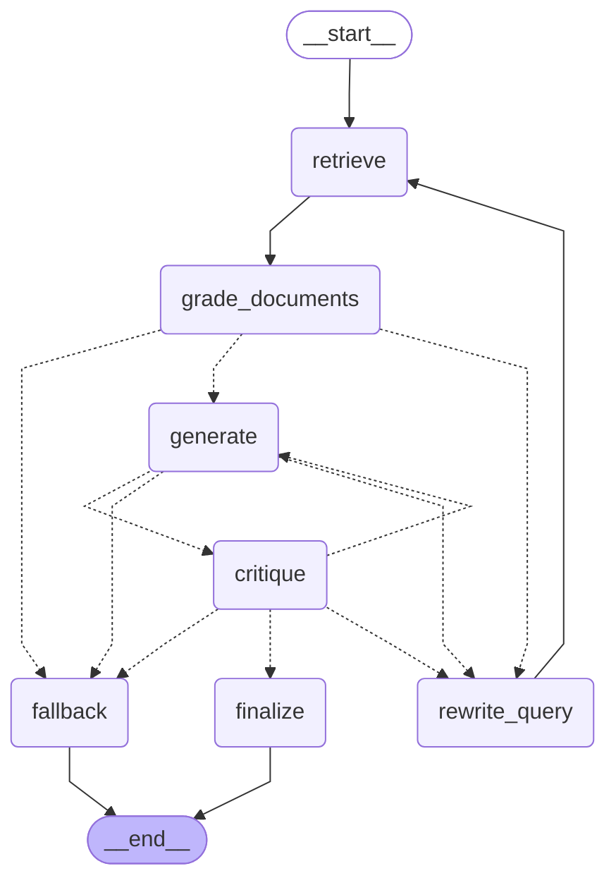

```mermaid
---
config:
  flowchart:
    curve: linear
---
graph TD;
	__start__([<p>__start__</p>]):::first
	retrieve(retrieve)
	grade_documents(grade_documents)
	generate(generate)
	critique(critique)
	rewrite_query(rewrite_query)
	finalize(finalize)
	fallback(fallback)
	__end__([<p>__end__</p>]):::last
	__start__ --> retrieve;
	critique -.-> fallback;
	critique -.-> finalize;
	critique -.-> generate;
	critique -.-> rewrite_query;
	generate -.-> critique;
	generate -.-> fallback;
	generate -.-> rewrite_query;
	grade_documents -.-> fallback;
	grade_documents -.-> generate;
	grade_documents -.-> rewrite_query;
	retrieve --> grade_documents;
	rewrite_query --> retrieve;
	fallback --> __end__;
	finalize --> __end__;
	classDef default fill:#f2f0ff,line-height:1.2
	classDef first fill-opacity:0
	classDef last fill:#bfb6fc
```
